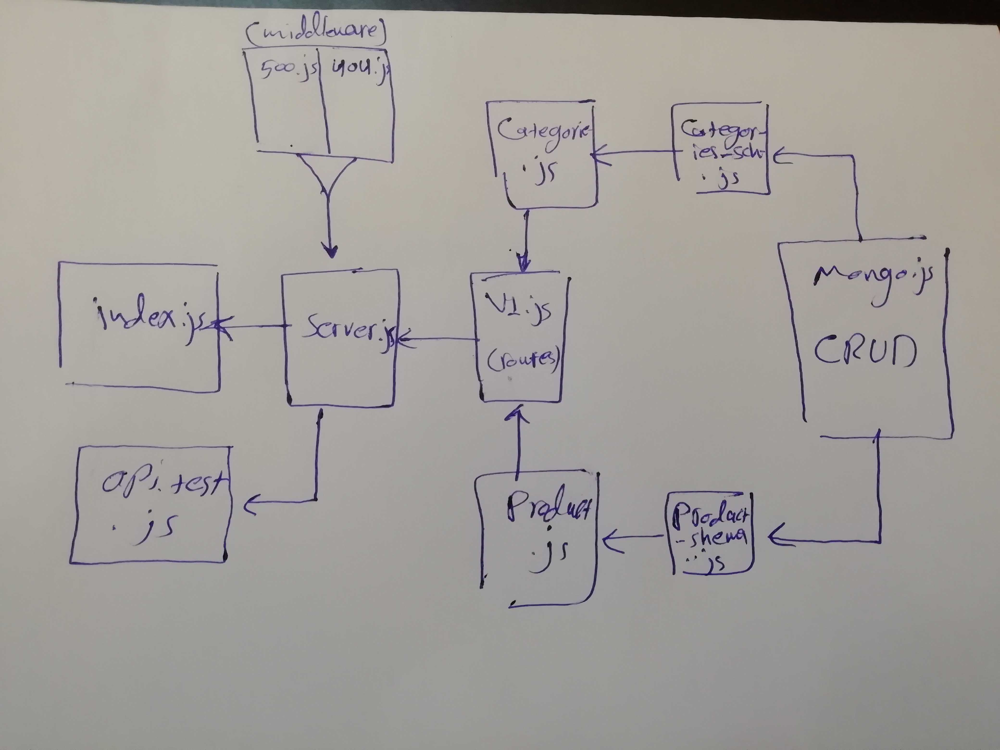

# LAB - Class 09

## API Server

### Author: Naseem & Ibrahim

### Links and Resources

* [submission PR](https://github.com/naseem-401-advanced-javascript/lab-09)

### Setup

#### `.env` requirements (where applicable)
* `PORT` - 3000

#### How to initialize/run your application (where applicable)

- `npm run start` 

#### Tests

* How do you run tests?
`npm run start `
* Any tests of note?
 no
* Describe any tests that you did not complete, skipped, etc

#### UML

